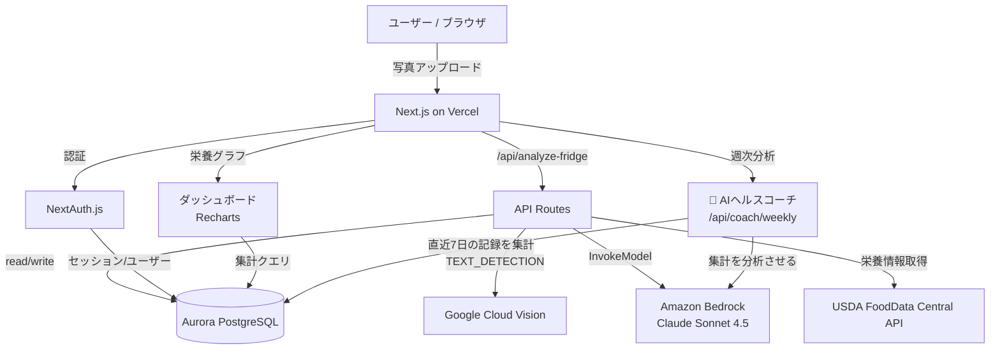

# 冷蔵庫AIアプリ — H0ハッカソン 拡張プラン

## 1. ハッカソン概要

| 項目 | 内容 |
|------|------|
| 名称 | H0 Hackathon（Vercel × AWS Databases） |
| トラック | **オープンイノベーション** |
| テーマ（本プロジェクト） | 健康管理 — 冷蔵庫の食材から「健康目標に合わせた献立」と「栄養管理」を提供 |
| 締切 | 2026-06-29 17:00 PT |
| 賞金 | 現金 $80,000 + AWSクレジット $80,000 |
| 必須要件 | AWS DB（Aurora PostgreSQL / Aurora DSQL / DynamoDB）+ Vercel/v0デプロイ |
| 提出物 | デモ動画(3〜5分) + アーキテクチャ図 + スクリーンショット |

---

## 2. プロダクトコンセプト

> **「冷蔵庫を撮るだけで、あなたの健康目標に合った献立と栄養管理ができる」**

冷蔵庫の写真 → 食材認識 → **ユーザーの健康目標を考慮した**献立提案 → **栄養情報を記録・可視化**。
単発の献立提案から「継続的な健康管理ツール」へ進化させる。

### 既存（現状）
```
冷蔵庫の写真 → Vision OCR → Claude → 献立提案（その場限り・記録なし）
```

### 拡張後
```
冷蔵庫の写真 → Vision OCR → Claude（健康目標を考慮）
   → 栄養情報付き献立提案
   → Aurora PostgreSQL に記録
   → 栄養ダッシュボードで日次・週次を可視化
```

---

## 3. アーキテクチャ



**目玉のデータフロー**: ダッシュボードが「記録の可視化」を担い、AIヘルスコーチが
DBに蓄積した直近データをBedrockに渡して「次の行動アドバイス」を生成する。
= AWS DBが価値を生む構造を一目で示せる。

**H0要件の充足**: Aurora PostgreSQL（AWS DB）✅ / Vercelデプロイ ✅

---

## 4. 機能一覧と優先度（審査インパクトで決定）

**🌟 目玉機能 = AIヘルスコーチ**（蓄積した栄養記録をClaudeが分析し週次アドバイス）。
これがデモのクライマックスであり、独創性×インパクト×AWS DB活用の三冠を狙う。
**認証 = 本格認証**（NextAuth + OAuth）で「本番運用できるプロダクト」感を出す。

### 優先度の考え方
目玉のAIヘルスコーチは「蓄積データ」が前提。よって **記録 → ダッシュボード → コーチ** の順に土台を積む。デモ・ストーリー①〜⑤が回るのに必要なものを **P0** に置く。

| # | 機能 | 状態 | 優先度 | 審査での役割 |
|---|------|------|:---:|------|
| 1 | 冷蔵庫写真 → 食材認識 → 献立提案 | ✅ 既存 | P0 | 入口（既存資産） |
| 2 | 本格認証（NextAuth + OAuth） | 🆕 | **P0** | 実世界適用性・本番感 |
| 3 | 健康目標プロフィール | 🆕 | **P0** | パーソナライズの起点 |
| 4 | 健康目標を考慮した献立提案 | 🔧 | **P0** | UX・独創性 |
| 5 | 献立の栄養情報の付与 | 🔧 | **P0** | コーチ/ダッシュボードの素データ |
| 6 | 献立・栄養記録の保存（履歴） | 🆕 | **P0** | DB書込・コーチの前提 |
| 7 | 栄養ダッシュボード（日次/週次） | 🆕 | **P0** | デモ映え・コーチの根拠可視化 |
| 8 | **🌟 AIヘルスコーチ（週次AI分析）** | 🆕 | **P0(目玉)** | 独創性◎・インパクト◎・DB活用◎ |
| 9 | 買い物リスト（不足食材の提案） | 🆕 | **P1** | 独創性プラス・(追加推奨)ゆらぎの解消 |
| 10 | 多言語対応（日英切替 i18n） | 🆕 | **P1** | グローバル審査への伝達性 |

---

## 5. DBスキーマ設計（Aurora PostgreSQL）

```sql
-- ユーザー
CREATE TABLE users (
  id            UUID PRIMARY KEY DEFAULT gen_random_uuid(),
  email         TEXT UNIQUE NOT NULL,
  name          TEXT,
  created_at    TIMESTAMPTZ DEFAULT now()
);

-- 健康目標プロフィール
CREATE TABLE health_profiles (
  user_id           UUID PRIMARY KEY REFERENCES users(id) ON DELETE CASCADE,
  age               INT,
  sex               TEXT,            -- male / female / other
  activity_level    TEXT,            -- low / moderate / high
  target_calories   INT,            -- 1日の目標kcal
  target_protein_g  INT,            -- 1日の目標タンパク質(g)
  target_sodium_mg  INT,            -- 1日の塩分上限(mg)
  target_fiber_g    INT,            -- 1日の食物繊維目標(g)
  goal              TEXT,            -- diet / muscle / maintain など
  updated_at        TIMESTAMPTZ DEFAULT now()
);

-- 献立記録（提案を「食べた」と記録した単位）
CREATE TABLE meal_logs (
  id            UUID PRIMARY KEY DEFAULT gen_random_uuid(),
  user_id       UUID REFERENCES users(id) ON DELETE CASCADE,
  menu_name     TEXT NOT NULL,
  description   TEXT,
  ingredients   JSONB,           -- ["鶏むね肉", "ブロッコリー"]
  calories      NUMERIC,
  protein_g     NUMERIC,
  fat_g         NUMERIC,
  carbs_g       NUMERIC,
  sodium_mg     NUMERIC,         -- 塩分(mg)
  fiber_g       NUMERIC,         -- 食物繊維(g)
  eaten_at      DATE NOT NULL DEFAULT CURRENT_DATE,
  created_at    TIMESTAMPTZ DEFAULT now()
);
CREATE INDEX idx_meal_logs_user_date ON meal_logs(user_id, eaten_at);

-- AIヘルスコーチの週次アドバイス履歴
CREATE TABLE coach_advices (
  id            UUID PRIMARY KEY DEFAULT gen_random_uuid(),
  user_id       UUID REFERENCES users(id) ON DELETE CASCADE,
  period_start  DATE NOT NULL,    -- 分析対象期間の開始日
  period_end    DATE NOT NULL,    -- 分析対象期間の終了日
  summary       JSONB,            -- 集計スナップショット（平均PFC・塩分・繊維、達成率）
  advice        TEXT NOT NULL,    -- Claudeが生成したアドバイス本文
  created_at    TIMESTAMPTZ DEFAULT now()
);
CREATE INDEX idx_coach_advices_user ON coach_advices(user_id, created_at DESC);
```

---

## 6. API設計

### 既存改修: `POST /api/analyze-fridge`
- プロンプトに **ユーザーの健康目標** を注入（target_calories / goal 等）
- `MenuItem` 型に栄養フィールドを追加:
  ```ts
  type MenuItem = {
    name: string
    description: string
    ingredients: string[]
    cookingTime: string
    difficulty: string
    nutrition: {            // 🆕 追加
      calories: number
      protein_g: number
      fat_g: number
      carbs_g: number
      sodium_mg: number     // 塩分
      fiber_g: number       // 食物繊維
    }
  }
  ```
- 栄養はまず Claude に概算させる（MVP）→ 余力で USDA API で精緻化

### 新規API
| メソッド | パス | 役割 |
|---------|------|------|
| GET/PUT | `/api/profile` | 健康目標の取得・更新 |
| POST | `/api/meal-logs` | 献立を「食べた」と記録 |
| GET | `/api/meal-logs?range=week` | 栄養記録の取得（集計用） |
| GET | `/api/nutrition/summary` | 日次/週次の栄養サマリー |
| GET | `/api/coach/weekly` | 🌟 直近7日の記録を集計→Bedrockで週次アドバイス生成 |

### 🌟 `/api/coach/weekly`（目玉）の処理フロー
1. `meal_logs` から直近7日分を集計（合計/平均カロリー・PFC・塩分・食物繊維、目標との差分）
2. 集計結果 + `health_profiles` の目標を Claude に渡す
3. Claude が「達成できた点 / 不足している栄養 / 明日以降の具体的提案」を生成
4. `coach_advices` に集計スナップショット + アドバイス本文を保存（履歴化）。コーチ画面で過去の推移・アドバイス履歴も振り返れる

---

## 7. 実装マイルストーン

### M1: 基盤（インフラ）
**開発基盤（ローカル）— ✅ 完了**
- [x] ローカル開発DB: Colima + Docker で PostgreSQL 16 を起動（`docker-compose.yml`）
- [x] DBクライアント導入: **Drizzle ORM** + pg（`lib/db/index.ts`）
- [x] スキーマを TS 定義（`lib/db/schema.ts`）— Auth.js標準4表 + アプリ3表
- [x] migration 生成・適用（`drizzle/`）+ pgドライバ経由の接続テストOK（7表）
- [x] `.env.local` に `DATABASE_URL` 設定 / npm scripts（db:up/down/generate/migrate/studio）

**本番DB（デプロイ時に実施）— M6前後**
- [ ] Vercel Marketplace 経由で Aurora PostgreSQL をプロビジョニング
- [ ] 本番 `DATABASE_URL` を Vercel 環境変数に設定 → `drizzle-kit migrate` を本番適用

> 設計変更メモ: 認証=NextAuth本格認証に合わせ `users.id` を `uuid`→`text`（Auth.js標準）に変更。
> 開発はローカルDockerファースト（無料・高速）、本番Auroraはデプロイ段階で接続する2段構え。

### M2: 認証 + プロフィール
- [ ] NextAuth.js 導入（メール/OAuth）
- [ ] 健康目標プロフィール入力画面 + `/api/profile`

### M3: 献立提案の健康対応（コア改修）— ✅ 完了
- [x] `analyze-fridge.ts` のプロンプトに健康目標を注入（セッション→health_profiles読込）
- [x] `MenuItem` に栄養情報（カロリー/P/F/C/塩分/繊維）を追加 + パース対応
- [x] フロントの献立カードに栄養表示 + 「🎯 健康目標を反映」バッジ
- [x] Bedrockモデル/リージョンを us-east-1（`us.anthropic.claude-sonnet-4-5...`）に統一
- [x] 実機確認: Googleログイン→目標保存→目標反映の栄養付き献立まで疎通OK

### M4: 記録 + ダッシュボード（コーチの土台）— ✅ 完了
- [x] 「食べた」記録機能 + `/api/meal-logs`（POST記録 / GET range取得、未認証401）
- [x] Recharts で週次カロリー棒グラフ（目標kcalの基準線つき）
- [x] 目標に対する進捗バー（カロリー/タンパク質/塩分/食物繊維、超過は赤表示）
- [x] ナビ整備（献立/目標/記録）、実機で記録→ダッシュボード反映を確認

### M5: 🌟 AIヘルスコーチ（目玉・デモのクライマックス）— ✅ 完了
- [x] `/api/coach/weekly`：直近7日集計 → Bedrockで週次アドバイス生成 → coach_advicesに履歴保存
- [x] コーチ画面UI（統計カード + 総評 / できている点 / 改善点 / 明日への提案）、i18n対応
- [x] **デモ用シードデータ**投入スクリプト（scripts/seed-meal-logs.mjs）、10日分投入済み
- [x] 実機確認: 集計に基づく具体的アドバイスが生成・表示されることを確認（7言語対応）

### M5.5: 買い物リスト（不足食材）※P2 → 正式実装に格上げ
- [ ] 献立の食材を「冷蔵庫にある / 追加で必要」に分離（analyze-fridge プロンプト + 型）
- [ ] 不足食材を「買い物リスト」として表示（現状の(追加推奨)ゆらぎを構造化して解消）

### M5.6: 多言語対応（i18n）※H0グローバル審査への配慮 — ✅ 完了（7言語）
- [x] i18n 基盤（辞書+Context+Provider、localStorage永続化）
- [x] 7言語対応：日本語/English/中文/한국어/Français/Español/Português
- [x] 言語別辞書を locales/*.ts に分割、jaを型基準にキー網羅をtscで強制
- [x] 言語ドロップダウン（LangSelect）を全画面ヘッダーに配置
- [x] 既存画面（献立/ログイン/プロフィール/ダッシュボード）をi18n化
- [x] 献立の動的テキスト（料理名/説明/食材）も選択言語で生成（プロンプトにlang注入）
- [ ] 今後コーチ画面を作る際もi18n対応する／提出物（動画/README）も英語化

### M6: 仕上げ + 提出
- [ ] （余力）買い物リスト機能
- [ ] アーキテクチャ図の清書
- [ ] デモ動画（3〜5分）撮影・編集 — 下記ストーリーボードに沿って
- [ ] スクリーンショット + Devpost 提出フォーム記入

---

## 7.5 審査対策（「よく見える」ための仕込み）

審査員は基本的に**デモ動画・アーキ図・スクショ**で判断する。以下を意識する。

### デモ・ストーリーボード（3〜5分）
1. **課題提示（30秒）**: 「健康的に食べたいが、何を作れば目標に合うか分からない」
2. **健康目標を設定（20秒）**: ダイエット中・1日1800kcal・タンパク質60g
3. **冷蔵庫を撮影 → AI提案（60秒）**: "あなたの目標に合わせた" 栄養情報付き献立 ← パーソナライズ
4. **記録 → ダッシュボード（40秒）**: 「今日あと○kcal」「週次PFC達成率」グラフ
5. **🌟 AIヘルスコーチ（60秒・クライマックス）**: 蓄積データをAIが分析し「今週はタンパク質不足、明日は魚を」と具体提案
6. **技術アピール（30秒）**: アーキ図で「Vercel + Bedrock + Aurora PostgreSQL」、DBが価値を生む構造を説明

### 仕込みポイント
- **シードデータ必須**: コーチもダッシュボードも「蓄積データ」がないと映えない。デモ前に1〜2週間分を投入
- **アーキ図で "AWS DB活用" を強調**: 既存のDiagram AIアプリ（自分の資産）で作図すると、それ自体もアピールになる
- **本番URLを必ず生かす**: 審査員が実際に触れる状態に。本格認証のOAuthログインも見せる
- **数値で語る**: 「目標2000kcalに対し1850kcal、達成率92%」のような定量表示はインパクト・技術の両面で効く

---

## 8. 提出物チェックリスト

- [ ] 公開URL（Vercel本番）
- [ ] GitHubリポジトリ（Public）
- [ ] デモ動画 3〜5分
- [ ] アーキテクチャ図（本書のmermaidを画像化 / Diagram AIアプリ活用も可）
- [ ] スクリーンショット数点
- [ ] テキスト説明（インスピレーション/技術/苦労した点）

---

## 9. 技術選定メモ

- **DBアクセス**: `@vercel/postgres` か `drizzle-orm`。Aurora PostgreSQL は標準PostgreSQL互換なので `pg` ドライバでも可。
- **栄養データ**: MVPは Claude の概算で十分。精度を上げるなら USDA FoodData Central API（無料）。
- **認証**: NextAuth.js + OAuth（Google等）で本格認証。Vercelと相性良。「本番運用できるプロダクト」感を出すため簡易認証は採らない。
- **言語方針**: 日英切替(i18n)対応を採用。H0はグローバル系で審査員が英語話者の可能性が高いため、UIを日英切替にしつつ提出物（動画/説明/README）は英語で用意する。
- **既存資産**: Vision OCR・Bedrock呼び出し・iOS Safari対応UIはそのまま流用。
